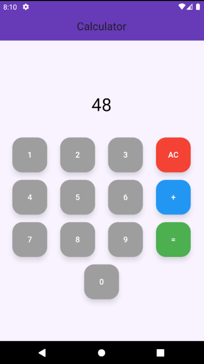

# Flutter Calculator App

This is a simple calculator application built with Flutter. The app allows users to perform basic addition operations using a clean and minimalistic interface. Users can input numbers using on-screen buttons and get the result by pressing the "=" button. The "AC" button clears the input.

## Features

- Number input (0–9)
- Addition operation using `+` button
- Clear input with `AC` button
- Evaluate the result with `=` button


## Installation

To run this project locally on your machine, follow these steps:

1. Clone the repository:
   ```bash
   git clone https://github.com/your-username/flutter-calculator.git
   cd flutter-calculator
   ```

2. Install dependencies:
   ```bash
   flutter pub get
   ```

3. Run the app:
   ```bash
   flutter run
   ```

## File Structure

- `lib/`
  - `main.dart`: Main source file containing the UI and logic.
- `images/`
  - `calculator.png`: App screenshot or icon used in the README.

## UI Overview

- Simple and user-friendly interface
- Input updates in real time as buttons are pressed
- Only supports addition for demonstration purposes

## Contributing

Feel free to contribute by forking the repository, making your changes, and submitting a pull request. Suggestions and improvements are always welcome.

---

Thanks for checking out the project!


## Getting Started

This project is a starting point for a Flutter application.

A few resources to get you started if this is your first Flutter project:

- [Lab: Write your first Flutter app](https://docs.flutter.dev/get-started/codelab)
- [Cookbook: Useful Flutter samples](https://docs.flutter.dev/cookbook)

For help getting started with Flutter development, view the
[online documentation](https://docs.flutter.dev/), which offers tutorials,
samples, guidance on mobile development, and a full API reference.
